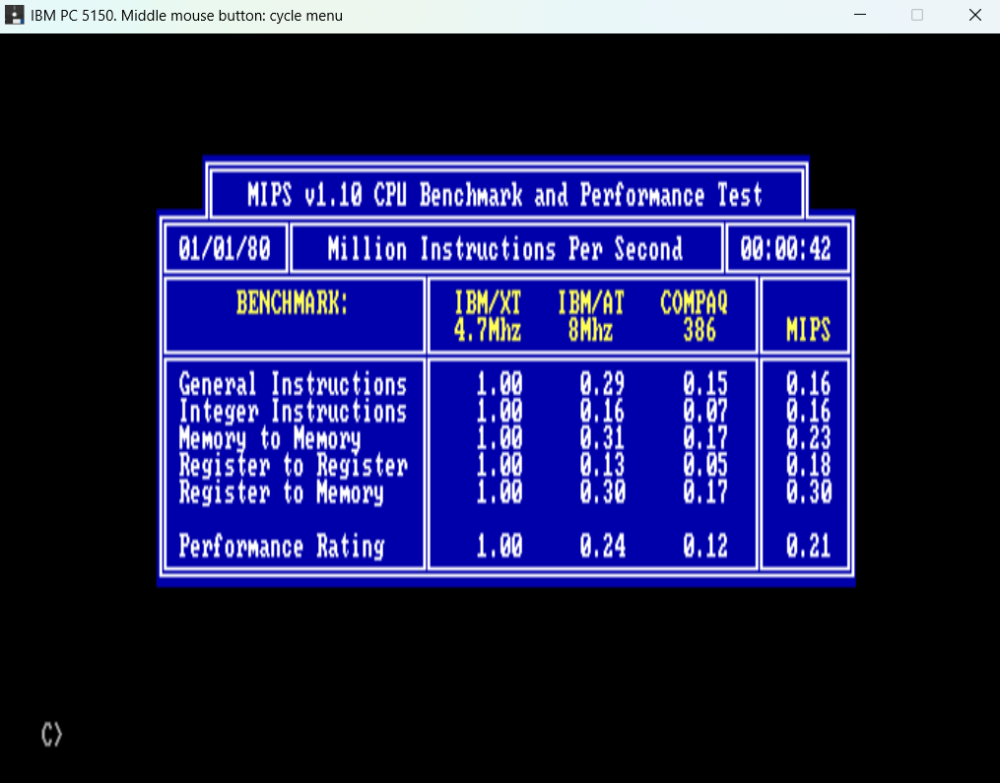
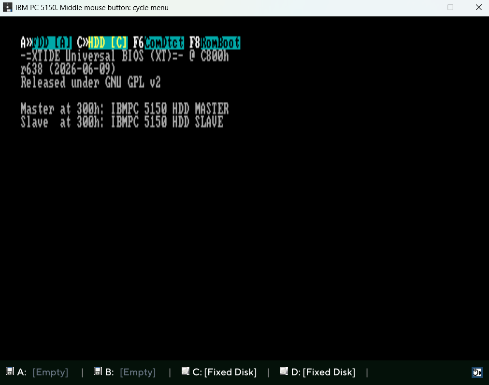
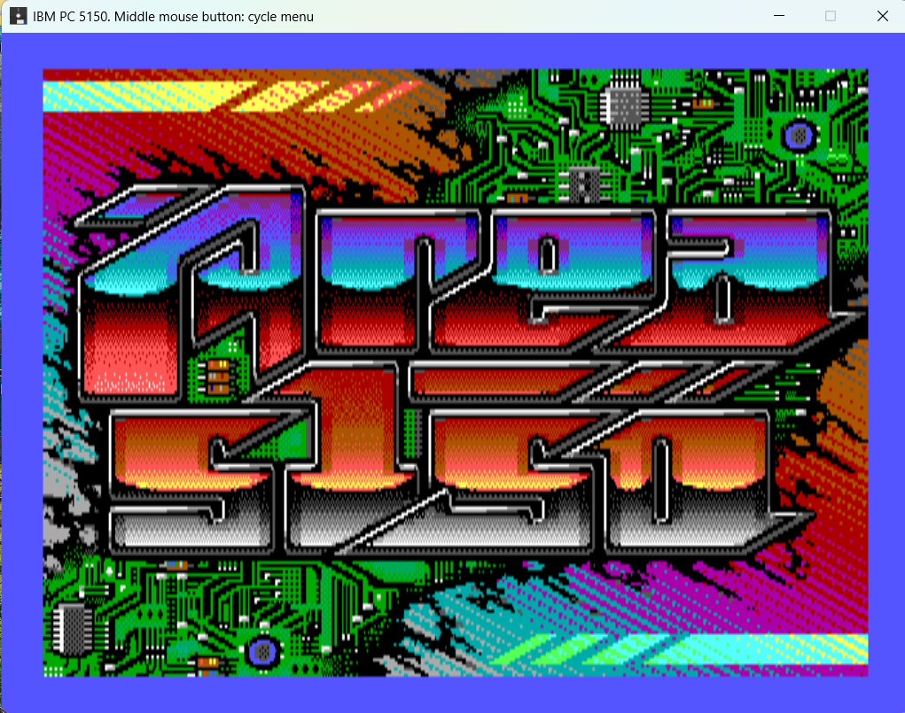

# IBM5150-emulator
A time-accurate and cycle-accurate 5150 Emulator

I've been developing several IBM PC 5150 emulators over the years but never published them. I usually just do this for myself, the goal is always the same: play BIGTOP, run MIPS.COM, and enjoy.

This time is different. Two months ago, I decided to build a cycle-accurate emulator. All my previous ones were accurate enough to play my favorite game, BIGTOP, but I was tired of seeing MIPS.COM benchmarks fluctuate between 0.98 and 1.02. I wanted an emulator that runs consistently at 1.00.

I have to say, I've never found an emulator that does this. I hate to phrase it this way because there are great emulators out there built by fantastic developers, but I've never been able to get any of them to run MIPS.COM at 1.00 across all tests within 25 seconds. That's because cycle-accuracy (the same amount of ticks) and time-accuracy (the same amount of seconds) are two different things. It was a difficult challenge, but if I could do it, many others can too.

So, this is why I am publishing this emulator, ready to run.

Thanks to reenigne at https://github.com/reenigne/reenigne for his great work.

Emulator specs:
- Double floppy 360KB, can also mount and boot 720KB but cannot be formatted( as the real one otherwise use drivparm )
- Speaker sound
- Tandy audio
- Simple CGA and a full specs CGA to run AREA5150.
- XTIDE support for card version 1, can handle 2 HDDs
- Middle mouse button activate menu for floppy disk operations and reboot
- Joystick support
- Config.ini for configuration
- Experimental floppy disk sounds

