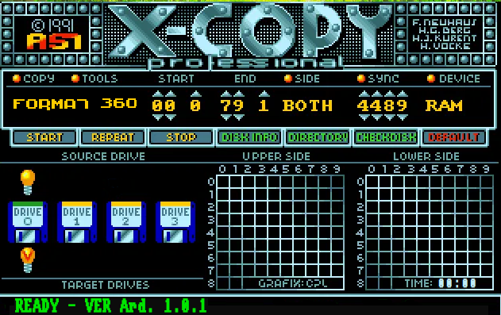
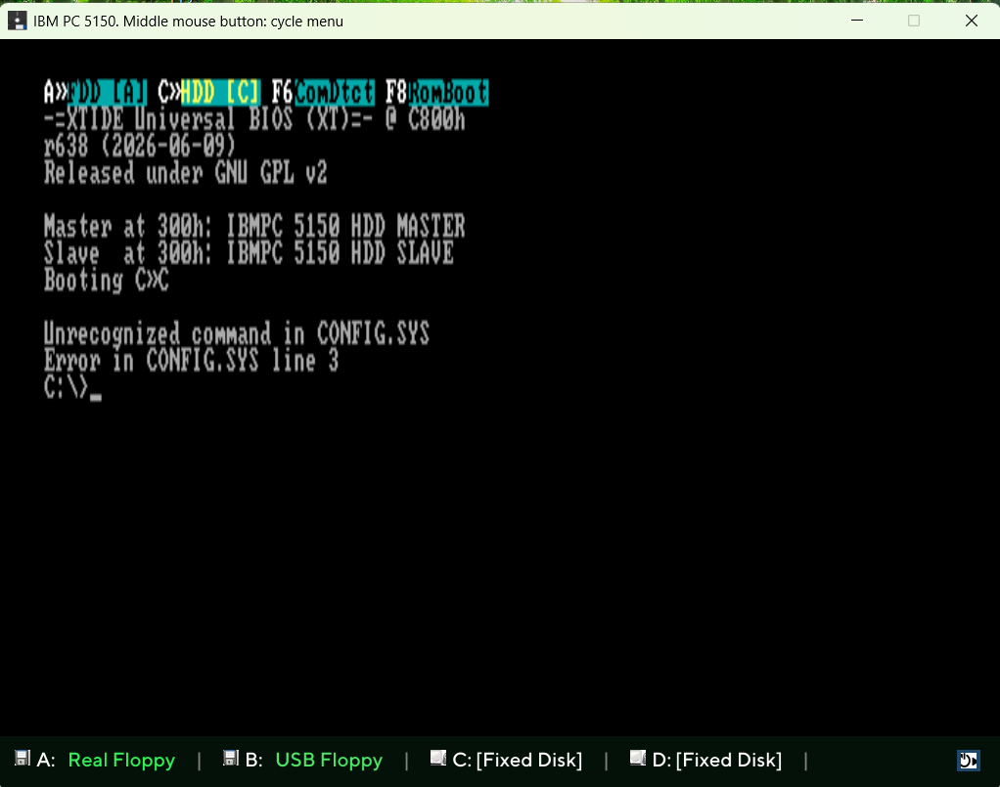
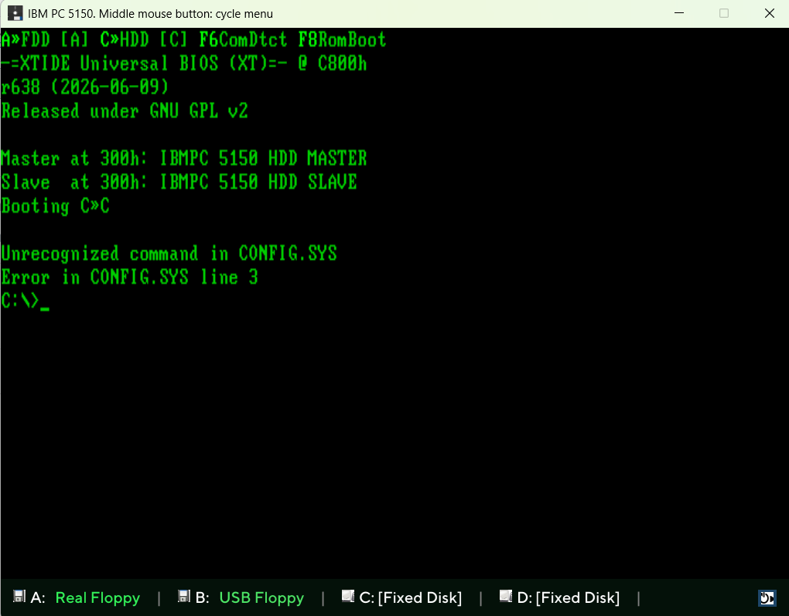
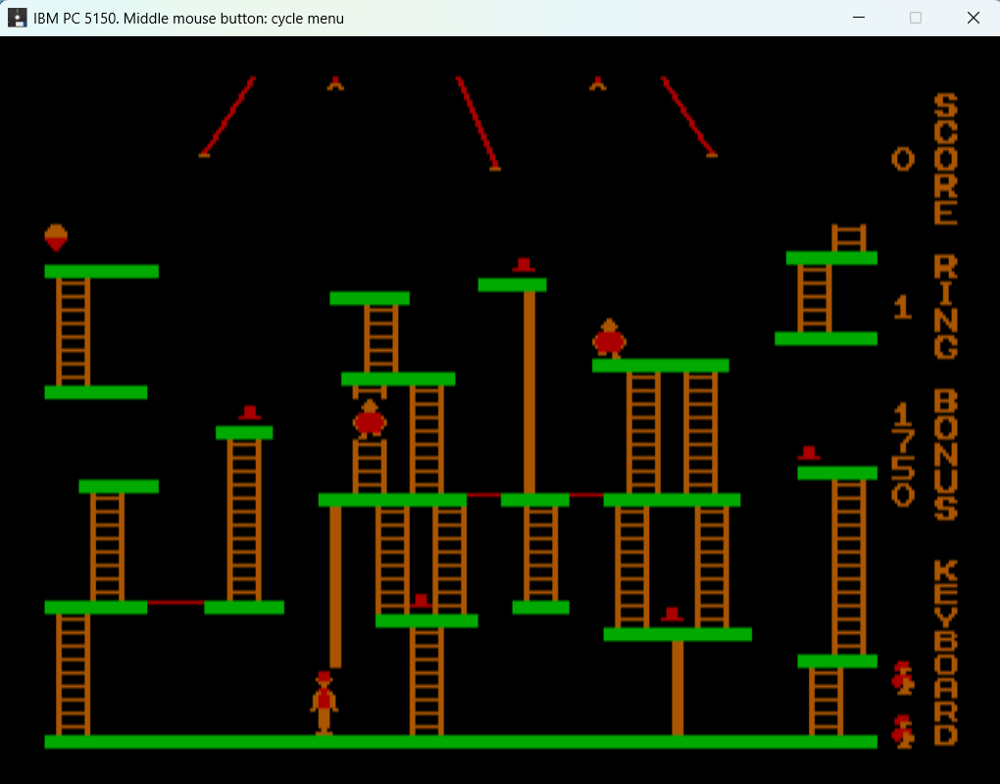

# IBM5150-emulator
A time-accurate and cycle-accurate 5150 Emulator

version release 1.1

-added support for Hercules graphic card ( still not perfect in graphic mode )

-added support for Usb floppy disk, can be configured as A: or B:, only 720kb( 1.44MB drive can be used) supported: write, read and format operations.

-added support for floppy disk connected via Arduino mega, in the release you can find the .hex file to program the microcontroller.
 Can be configured as A: or B:, 5.25" 360KB and 3.5" 720KB supported(can be used 1.44MB floppy drive). Supported write, read and format operations. Schematic can be found in https://github.com/dhansel/ArduinoFDC search for the Arduino Mega.
Connection will be at 2Mbs with hardware flow control via FT232RL
!!!!   Attention mods to apply !!! 
Added serial connection for FT232RL connected to UART3 and also connect pin cts of FT232RL  to Arduino mega pin A2.

Config.ini has changed, you will find it in the distro.

Example floppy disk and hdd can be found on previous release.

Added the windows utility Realfloppy that allows to connect to arduino and make operations on the floppy disk from windows.
- click on format to change from 360 to 720
- click "start" to low level format a floppy and build dos fat12.
- click on "copy"  to save the floppy disk content to "floppy.img". Size (360 or 720 ) depends on format type selected.
- drag and drop a file on the screen and will be written to the floppy disk. Type of floppy will be calculated by the size of the .img selected. Supported 180kb, 360kb and 720kb.
 

version pre-release

! please notice that only the x86 version has:
- data folder
- config.ini
- bin files
- img files
- font files
  
! Please copy them to you folder.

I've been developing several IBM PC 5150 emulators over the years but never published them. I usually just do this for myself, the goal is always the same: play BIGTOP, run MIPS.COM, and enjoy.

This time is different. Two months ago, I decided to build a cycle-accurate emulator. All my previous ones were accurate enough to play my favorite game, BIGTOP, but I was tired of seeing MIPS.COM benchmark fluctuate between 0.98 and 1.02. I wanted an emulator that runs consistently at 1.00.

I have to say, I've never found an emulator that does this. I hate to phrase it this way because there are great emulators out there built by fantastic developers, but I've never been able to get any of them to run MIPS.COM at 1.00 across all tests within 25 seconds. That's because cycle-accuracy (the same amount of ticks) and time-accuracy (the same amount of seconds) are two different things. It was a difficult challenge, but if I could do it, many others can too.

So, this is why I am publishing this emulator, ready to run.

Thanks to reenigne at https://github.com/reenigne/reenigne for his great work.

Emulator specs:
- Double floppy 360KB, can also mount and boot 720KB but cannot be formatted( as the real one otherwise use drivparm )
- Speaker sound
- Tandy audio
- Simple CGA and a full specs CGA to run AREA5150.
- XTIDE support for card version 1, can handle 2 HDDs
- Middle mouse button activate menu for floppy disk operations and reboot
- Joystick support
- Config.ini for configuration
- Experimental floppy disk sounds

